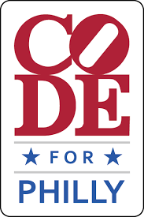
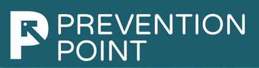
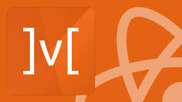

# How the Code for Philly fellowship helped me jumpstart my career

We all know how challenging it is to be in a job that you don’t really enjoy. How much harder is to get out of bed every day, get dressed and go to a place (or nowadays join a Zoom call) that you don’t really want to be at. That’s how it has been lately for me. I have been working as an elementary educator for 15 years and I have reached a point where I got “burned out”. So it was time for a change.

## From Education to Coding

Let me start by telling you that it hasn’t been an easy journey. Getting out of your comfort zone, trying things that are completely new to you and constantly learning new things that sometimes (at the beginning at least) don’t even make sense...this is what getting into coding was to me in the beginning.

As a complete newbie to the world of Web Development, I started my journey by enrolling into a Coding Bootcamp. It was the most challenging 6 months of my life! I had to stop being a teacher and start being a student, hear and learn things that were hard to comprehend and practice, practice, practice! But in the end I did it, and got the coveted certification! I thought “Yay! Now I am a developer! Time to get my first job!” and was expecting to be handed a junior position just like that. How wrong I was! My journey has just started…

When you make a career change like that, to a subject that was completely unknown a few months earlier, you are always in doubt and your good old pal, imposter syndrome, is always by your side. I had to surround myself with people that understood my journey, that could support me and guide me. And I was lucky enough to stumble upon Code for Philly. I applied and kept my fingers crossed...

## Ready, set, start coding! (for real this time!)

When I got the email that I got one of the spots as a fellow for Code for Philly, I couldn’t believe in my eyes… good old imposter syndrome was right there, whispering in my ear: “I can’t believe they chose you! You are so green, you will surely fail!”. Then I met the people that I would code with for the next 8 weeks. Marieke, Liz, Pat and my mentor Mikey. It was as if they read my mind and from our very first meeting they wanted to make sure that all of us felt welcomed and supported in the program. They were also nervous since this was the first round for the fellowship, so we were all in this together.

Then it was time for my first one on one session with Mikey, my mentor. I was so nervous!

## How the fellowship works

For the next 8 weeks I became part of the Prevention Point project, building a product that would benefit the Prevention Point, a needle exchange program in North Philly.

Each week I would receive a ticket in GitHub, with detailed instructions from the mentor. Then I would try to resolve the ticket by myself. At the beginning of the following week I would meet with my mentor to discuss the ticket and get into more detail about the technologies used.

Since I am more interested in front-end development and React.js in particular, that’s where the main focus of the fellowship would be. During the mentoring sessions we talked about various aspects of React, like how to manipulate global state with Mobx (an alternative to Redux), testing with Jest and object manipulation. Mikey would provide guidance while I was doing the coding on my machine.

A significant part of our discussions were also around Git. As part of my bootcamp studies, most of the time I worked by myself, with the exception of 3 major group projects that I was paired with 2 or 3 more of my classmates to work together. You do not become fully prepared to join a larger developer team and get a feel of what the workflow looks like. That was a very valuable experience.

Working on a big project like that required me to improve my Git skills. There were many times where my frustration would come from managing to complete a ticket but not being able to make a proper pull request. Mikey taught me how to refer properly to issues, what the workflow looks like, and Git methods like “fetch” or “rebase” that I never used before.

## The adventures of job hunting

Being a Code for Philly fellow not only helped to improve my coding skills but also how to make my job search more effective. Mikey helped fine tune my portfolio, offered valuable insight on how to approach and maximize the results of my job search, and also provided much needed moral support. There were also specific career sessions that helped with public speaking and writing, and of course with writing a proper resume.

But the biggest take away was that for 8 weeks I felt part of a dev team, I got a feel for working as a coder, and I contributed to a large project, something that I would have much more limited opportunity to do on my own.

For those who want to make a similar change, who have decided you want to break into tech, and who got a foundation by learning the required skills but don’t know how to start - consider a fellowship like Code for Philly. You will get real life experience and feel more confident launching into your career search, while helping a good cause.   

